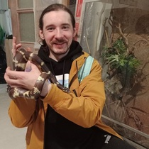
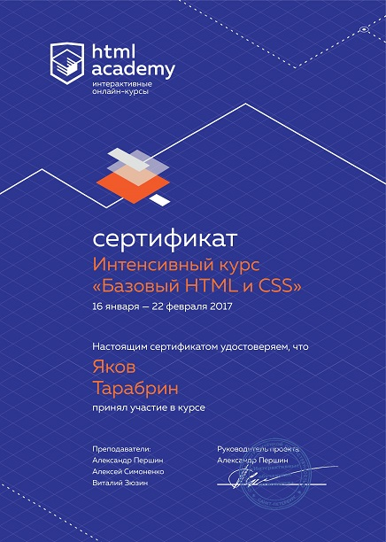

# Jacob Tarabrin


## Junior Frontend Developer

## Contacts
* email: tarabrinjac@gmail.com
* tel: +79669311845
* tg: @tarabrinja
* discord: @tarabrinja
* github: tarabrinjac

## About
My goal is to independently complete my education, abandoned due to circumstances, and become a professional developer in the field of web technologies. I love the web for accessibility in exploration and open friendly community. I am also attracted by the need to constantly acquire new knowledge. I myself strive to learn something new every day. This is how I experience personal growth.

## Skills
* HTML - 75%
* CSS - 45%
* JS - 15%
* DSA - 5%
* GIT - 45%
* VSC - 75%

## Code example
```
    function multiply(a, b){
        return a * b;
    }
```

## Experience
[CV web-page on gh-pages](https://tarabrinjac.github.io/rsschool-cv/)

## Education
* North Caucasus Humanitarian Technical Institute 2014-2017
Bachelor's degree


Informatics and Computer Engineering


5 out of 8 semesters completed
* HTML Academy

[Basic HTML and CSS](Basic-HTML-and-CSS.pdf)

## English language
A2 Elemetary - 45%

